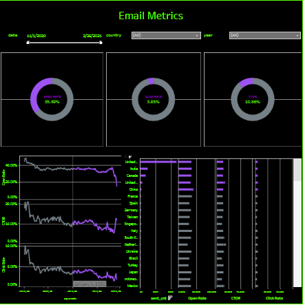

#  Email Marketing Analytics Dashboard

##  Project Overview
This project analyzes email campaign performance using SQL and visualizes key engagement metrics in Tableau.

The analysis focuses on understanding user behavior across the email funnel:
**Sent → Open → Click → Registration**

---

##  Business Context
Email marketing is a key acquisition and retention channel.

The main challenge:
 High delivery does not guarantee user engagement or conversion.

This project helps identify **where users drop off** and how to improve campaign performance.

---

##  Funnel Analysis

| Stage        | Metric        | Value |
|-------------|--------------|------|
| Sent        | Emails sent  | 100% |
| Open        | Open Rate    | ~35% |
| Click       | Click Rate   | ~3.8% |
| Engagement  | CTOR         | ~10.8% |

 **Key insight:** The biggest drop occurs between **Open → Click**

---

##  Data Processing (SQL)
- Joined multiple datasets using **LEFT JOIN** to preserve full user journey
- Aggregated metrics by **date and country**
- Used **UNION ALL** to combine behavioral and registration data
- Calculated engagement funnel metrics

---

##  Dashboard


Interactive Dashboard (Tableau Public):https://public.tableau.com/app/profile/.43866940/viz/EmailMetrics_17641650448850/EmailMetrics?publish=yes

---

##  Deep Insights

###  Strong Subject Lines, Weak Conversion
- Open Rate is relatively high (~35%)
- But Click Rate is very low (~3.8%)

 Users are заинтересовані enough to open  
 but not motivated to take action

---

###  CTA Problem (Critical Insight)
CTOR (~10.8%) shows that:
 only a small share of users who open emails actually click

 This indicates:
- weak call-to-action
- unclear value proposition
- content mismatch

---

###  Country-Level Variability
- Engagement varies significantly across countries
- Some regions outperform others in CTR

 Opportunity:
**localize campaigns instead of using one global template**

---

###  Engagement Instability Over Time
- Periods of decline suggest:
  - campaign fatigue
  - poor timing
  - repetitive content

---

##  Business Recommendations

###  1. Improve CTA (High Impact)
- Use clearer and more visible buttons
- Add urgency (e.g., “Limited offer”)

---

###  2. Personalization by Segment
- Customize content by country
- Adjust language and offers

---

###  3. Run A/B Tests
Test:
- subject lines
- CTA wording
- email layouts

---

###  4. Optimize Send Timing
- Identify best-performing days/hours
- Avoid over-sending

---

##  Tools Used
- SQL (Google BigQuery)
- Tableau (Data Visualization)
- GitHub (Version Control)

---

##  Project Structure
```
email-marketing-analytics/
│
├── sql/
│   └── email_metrics.sql
│
├── dashboard/
│   ├── Email Metrics.twbx
│   └── email_dashboard.png
│
└── README.md
```

