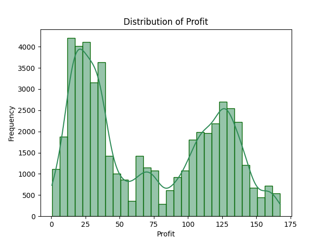
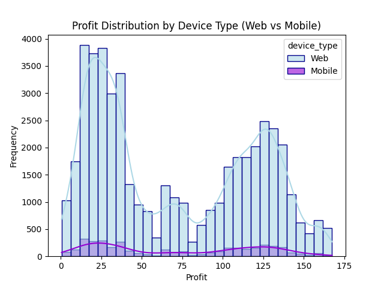
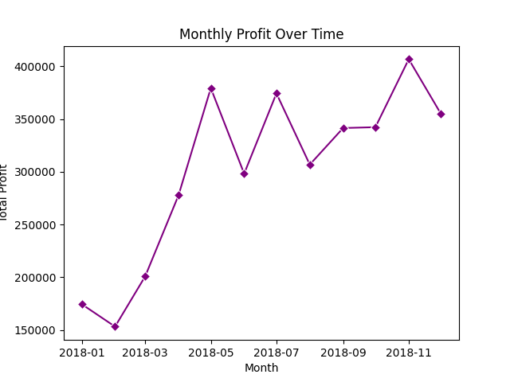
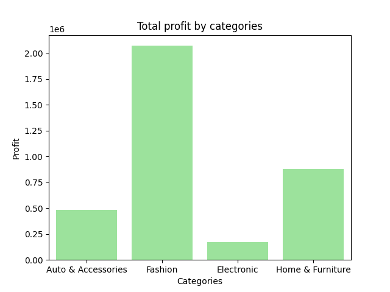
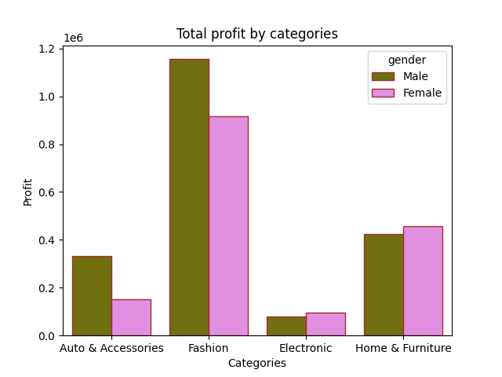

# Sales Data Visualization with Seaborn
##  Visualizations & Insights

### 1. Profit Distribution

 Most orders generate small profit, but there is a segment with high-profit orders.

---

### 2. Profit by Device

 Web dominates in volume, mobile contributes less.

---

### 3. Profit Trend Over Time

 Profit increases over time with fluctuations, strongest results at the end of the year.

---

### 4. Profit by Category

 Fashion is the most profitable, Electronic is the least.

---

### 5. Profit by Category & Gender

 Gender behavior differs by category:  
- Male dominates in Fashion and Auto  
- Female stronger in Home & Furniture
